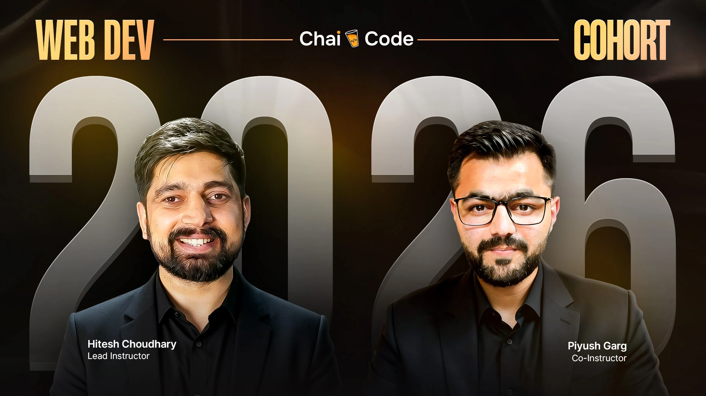

<a href="https://courses.chaicode.com/">
  

    
  

</a>
<h1 align="center">Chai Aur Cohort</h1>

<!-- Social Media Links -->

  
  
  

 

## Introduction

**Chai Aur Cohort** is a full-stack web development course by **[Hitesh Choudhary](https://www.youtube.com/@chaiaurcode)** & **[Piyush Garg](https://www.youtube.com/@piyushgargdev)**. From basics to full-stack ninja, this repository documents my in-depth learning journey within the program.

 

## Documentation

- ### [Assignments : learn](./assignments/README.md)

- ### [Blogs : showcase](./blogs/README.md)
 
