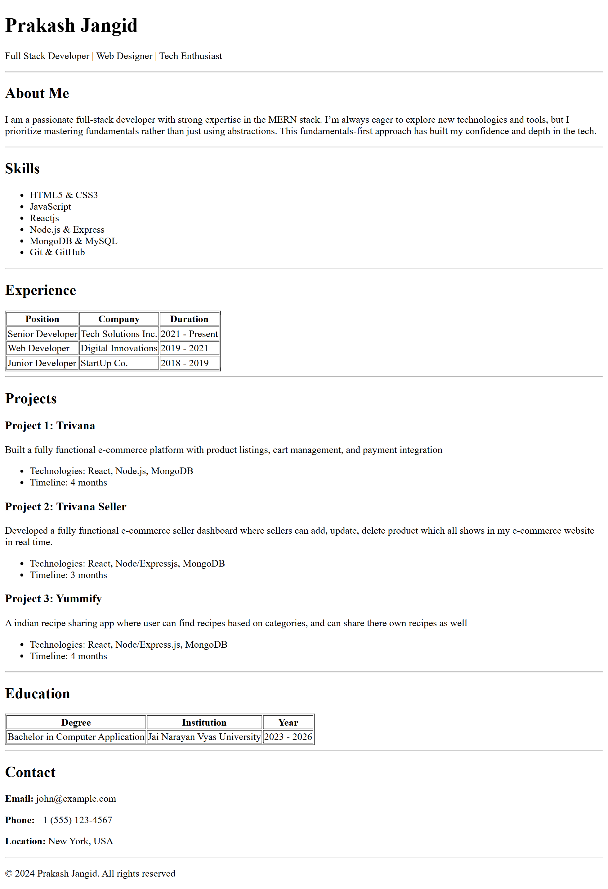

# Simple HTML Portfolio

This is a basic **HTML-only personal portfolio website**. It showcases profile information, skills, experience, projects, education, and contact details using semantic HTML.

---

## Project Structure

```
Portfolio-Assignment/
│── index.html
│── README.md
```

---

## Setup Steps

git clone https://github.com/Prakash-Jangid-hub/Cohort-HTML.git

2. **Open the Project Folder**

   ```bash
   cd project-folder
   ```

3. **Run the Project**
   - Simply open `index.html` in any modern web browser (Chrome, Firefox, Edge).

---

## Technologies Used

- HTML5

---

## Author

**Prakash Jangid**
Full Stack Developer | MERN Stack Enthusiast

## Preview


